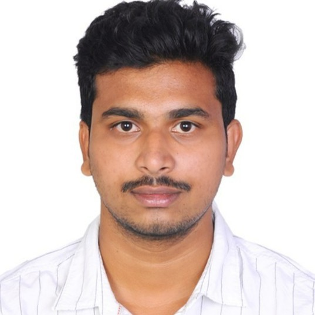

# Sai Chandhu Kanaparthi's Portfolio

**Email:** chandhukanaparthi22@gmail.com  
**Phone:** (614)-344-1676  
**Location:** Dayton, OH  

## Professional Summary

- 5 years of comprehensive experience in web application development, including analysis, design, and maintenance, with proficiency in both Agile and Waterfall methodologies.
- Expert in Java and Spring Boot, specializing in microservices architecture, RESTful API development, and security implementations using OAuth2.0 and Spring Security.
- Advanced skills in front-end technologies, including Angular, ReactJS, and modern JavaScript frameworks, with a focus on developing dynamic, responsive user interfaces.
- Proficient in backend technologies, utilizing Spring Framework (Spring Boot, Spring MVC, Spring Data), Hibernate, and Java EE for scalable and robust enterprise applications.
- Strong database management expertise, with experience in relational databases (MySQL, Oracle, PostgreSQL) and NoSQL databases (MongoDB), including designing complex schemas and optimizing queries.
- Experienced in cloud technologies and DevOps practices, including deploying applications on AWS (EC2, S3, Lambda) and optimizing cloud infrastructure, as well as implementing CI/CD pipelines with Jenkins, GitLab CI/CD, Docker, and Kubernetes.

## Technical Skills

**Methodologies:** SDLC, Agile, Waterfall, Scrum, TDD  
**Programming Languages:** C, C++, Java, JavaScript, Python, SQL  
**Frontend Technologies:** HTML5, CSS3, Bootstrap, JSP, AngularJS, NodeJS, ReactJS, Redux  
**Backend Technologies:** Spring Framework (Spring Boot, Spring MVC, Spring Data, Spring Security), Hibernate, J2EE, RESTful APIs, JMS, JDBC, Microservices Architecture  
**Messaging and Streaming:** Active MQ, JMS, SQS, Apache Kafka  
**Database Technologies:** MySQL, Postgres, Oracle, DB2, MongoDB  
**Cloud Technologies:** AWS, Azure, GCP  
**Containerization and Orchestration, CI/CD:** Docker, Kubernetes, Helm, Jenkins, GitLab  
**Version Control Tools:** Git, GitHub, SVN, BitBucket/Stash  
**API Documentation and Testing Tools:** JUnit, Mockito, Selenium, Postman, JMeter  
**Code Quality and Monitoring:** SonarQube, ELK Stack, Prometheus, Grafana, Log4J  
**Security and Authentication:** OAuth2.0, JWT  
**Development Tools and IDEs:** IntelliJ IDEA, Eclipse, Visual Studio Code, Spring Tool Suite, PyCharm, Anaconda  
**Design Patterns and Architectural Styles:** MVC, Microservices, Serverless Architecture  
**Web Services:** RESTful APIs, SOAP, API Gateway, Swagger, GraphQL  
**Other:** XML, JSON, Design Patterns, Linux/Unix  

## Professional Experience

### Client: CVS Health, Irving, TX  

**Role:** Java Full Stack Developer  
**Duration:** Jul 2023 – Present  

**Responsibilities:**
- Architected microservices with Java 17 and Spring Boot, ensuring modular and scalable architecture for Guidewire applications. Improved deployment speed by 40% and reduced system downtime by 30%, enabling efficient cloud-based testing environments.
- Developed automated testing frameworks for both back-end (Java) and front-end (React 18), improving QA efficiency by 50% and enhancing user interface testing for dynamic and responsive UIs.
- Utilized React’s state and props to efficiently manage and bind data retrieved from APIs to the view, enabling dynamic and interactive user interfaces.
- Engineered a suite of RESTful APIs integrated with MySQL databases and external services using Hibernate, optimizing data validation and test coverage for end-to-end testing.
- Containerized microservices using Docker and Kubernetes, deploying on AWS EKS for continuous integration and testing. Achieved 99.9% uptime in cloud-based environments.

### Client: Virtusa, Dallas, TX  

**Role:** Java Developer  
**Duration:** May 2022 – Jul 2023  

**Responsibilities:**
- Designed, developed, and maintained scalable, high-performance Java applications leveraging core Java concepts such as OOP, exception handling, multithreading, and collections.
- Utilized relational databases like MySQL, PostgreSQL, and Oracle, implementing efficient data access and management with JPA/Hibernate ORM.
- Developed enterprise-level applications using the Spring Framework (Spring Boot, Spring Security, Spring Data, Spring Cloud) for security, scalability, and modularity.
- Automated build processes using Maven and Gradle, and configured Jenkins for continuous integration.
- Developed and consumed RESTful APIs using Spring Boot, ensuring seamless integration with external services and third-party applications.

### Client: Wipro, Austin, TX  

**Role:** Java Software Engineer  
**Duration:** Jan 2021 – Apr 2022  

**Responsibilities:**
- Developed a scalable testing framework for a web application using Java, Spring Boot, and Angular, achieving 50% faster test execution.
- Deployed and tested applications on AWS Cloud services, utilizing Elastic Beanstalk, EC2, and RDS.
- Configured Jenkins for CI/CD pipelines, automating the testing, building, and deployment processes using Maven.
- Containerized Java applications using Docker, enabling consistent and portable deployments across various environments.

### Client: Genpact, Hyderabad, India  

**Role:** Java Developer  
**Duration:** Aug 2019 – Jan 2021  

**Responsibilities:**
- Designed and developed the user interface using Spring MVC, JSP, JSTL, JavaScript, custom tags, jQuery, HTML, and CSS to create dynamic and user-friendly web pages.
- Implemented the web layer of the application with Spring MVC, including the development of controllers, views, and validators.
- Automated test scripts using Selenium WebDriver and TestNG, decreasing manual testing efforts.
- Worked with IDE as Eclipse and deployed into Apache Tomcat Web Server, JBoss, and used Maven build tool to achieve more functionality for build process.
- Managed large datasets using NoSQL databases like MongoDB, ensuring high performance and scalability.

## Education

**Master of Science, Computer Science** | University of Dayton, Dayton, OH  
**Bachelor of Technology, Computer Science** | JNTU, India

  
